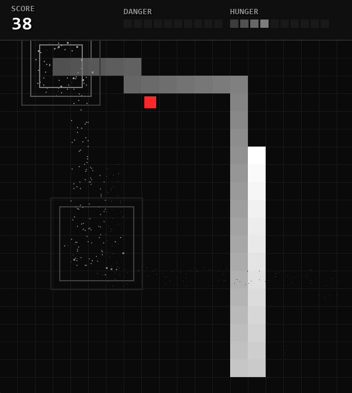

# Behavioral Cloning: Snake řízený Transformerem
### Semestrální projekt pro předmět Strojové učení (SU)



Pipeline pro **behaviorální klonování**, ve které se Transformer Encoder učí hrát hru Snake výhradně z lidských záznamů — bez Reinforcement Learningu. Hráč nasbírá data ručním hraním, ta se zpracují a augmentují, a natrénovaný model pak predikuje další akce i detekuje nebezpečné situace.

---

## Jak to funguje

| Krok              | Skript                               | Popis                                                                                                                         |
| ----------------- | ------------------------------------ | ----------------------------------------------------------------------------------------------------------------------------- |
| **1. Sběr dat**   | [`collect_data.py`](collect_data.py) | Hráč hraje Snake (v config.py je nutné pro sběr zpomalit rychlost hry), po každé hře uloží (`[S]`) nebo zahodí (`[D]`) záznam |
| **2. Zpracování** | [`process_data.py`](process_data.py) | Převod na relativní akce (rovně/vlevo/vpravo), Flood Fill detekce pastí, 8× augmentace (4 rotace × 2 flipy)                   |
| **3. Trénink**    | [`train.py`](train.py)               | Multi-task Transformer Encoder — predikce akcí + detekce pasti                                                                |
| **4. AI hraje**   | [`play.py`](play.py)                 | Inference s bezpečnostním filtrem a anti-loop logikou                                                                         |

---

## Model

**MultiTaskSequenceTransformer** — Transformer Encoder se dvěma výstupními hlavami:

* **Vstup:** Sekvence 100 kroků, každý krok = 128-dim vektor (lokální 11×11 mřížka, vektor k jídlu, vzdálenosti ke stěnám, poměr délky hada)
* **Action Head:** Predikce dalších 5 kroků (3 třídy: rovně / vlevo / vpravo)
* **Trap Head:** Binární klasifikace — je had v pasti?
* **Loss:** `CrossEntropy (akce) + 2.0 × BCEWithLogits (past)`

| Parametr                 | Hodnota             |
| ------------------------ | ------------------- |
| Vrstvy / Hlavy / d_model | 3 / 4 / 64          |
| Sekvence / Predikce      | 100 kroků / 5 kroků |
| Batch / LR / Epochy      | 256 / 0.0003 / 50   |
| Temperature (inference)  | 0.2                 |

---

## Inference — bezpečnostní logika

Model navrhne pravděpodobnosti akcí, ale **safety filter** odfiltruje tahy vedoucí do zdi nebo vlastního těla. Pokud had nejí déle než 80 kroků, aktivuje se **panic mode** s náhodnými bezpečnými tahy (prevence zacyklení).

---

## Spuštění

```bash
pip install torch pygame numpy
```

```bash
python collect_data.py    # 1. Sběr dat (volitelné — model je součástí repozitáře)
python process_data.py    # 2. Zpracování a augmentace
python train.py           # 3. Trénink
python play.py            # 4. Sledování AI (MEZERNÍK = pauza, R = restart)
```

---

## Struktura projektu

```
├── collect_data.py              # Sběr trénovacích dat (interaktivní hra)
├── process_data.py              # Augmentace, relativní akce, detekce pastí
├── train.py                     # Trénink modelu (Multi-Task Loss)
├── play.py                      # AI inference + safety filter
├── model.py                     # MultiTaskSequenceTransformer
├── utils.py                     # Feature extraction, bezpečnostní kontroly
├── config.py                    # Konfigurace (model, hra, efekty)
├── renderer.py                  # Pygame renderer s částicovým systémem
└── snake_transformer_best.pth   # Předtrénovaný model
```
